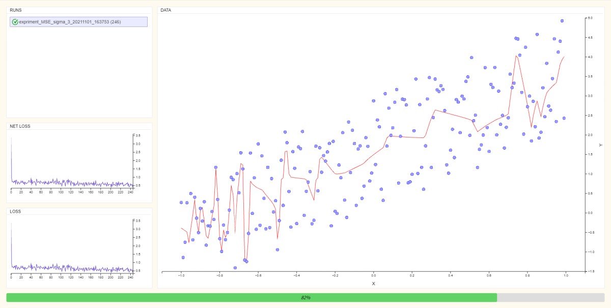

# Overfitting control with Inverse Cross Entropy loss function (ICE)

This is the source code for paper [Overfitting control with Inverse Cross Entropy loss function (ICE)](https://www.academia.edu/60659289/Overfitting_control_with_Inverse_Cross_Entropy_loss_function_ICE?source=swp_share).

In machine learning research community almost
all the time researchers use cross entropy between empirical
probability function and target energy function as loss function.
In this paper we explore the possibility of doing this in opposite
direction in other words taking cross entropy between empirical
energy function and the target probability function. We call
resulting loss function Inverse Cross Entropy (ICE). We prove
theoretically and experimentally that this will help us to have
control over overfitting, which is not directly possible with former
method.

<center></center>
<center></center>
## Install the dependencies

Install pytorch https://pytorch.org/get-started/locally/

Install websockets
```bash
pip install websockets
```
## Run entry point

```bash
python main.py
```
Open http://127.0.0.1:4444/ in browser

<center></center>
